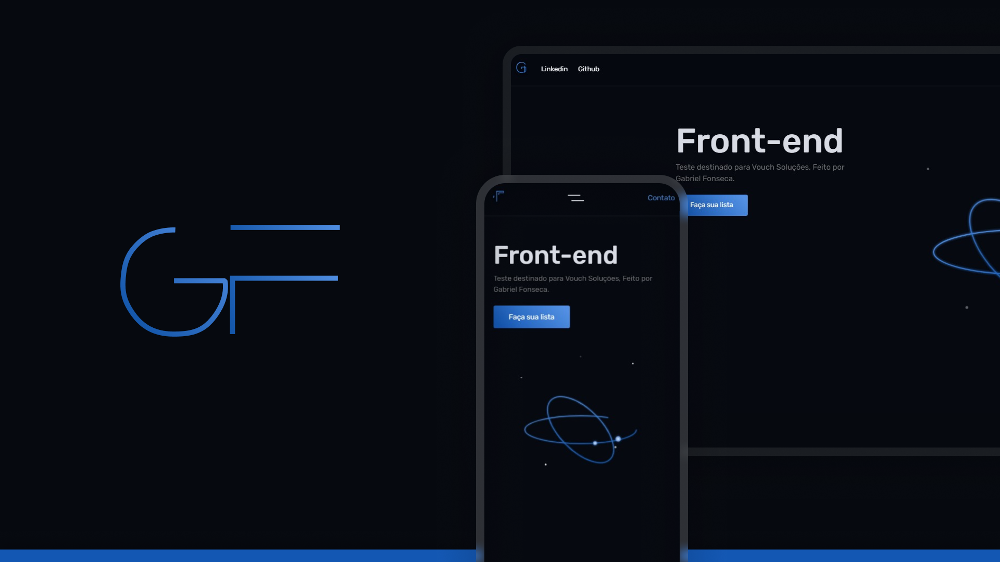

# Teste Voush Soluções

<br/>

<p align="center">
  
</p>

<div align="center">

[](#-tecnologias)  
[](#-projeto)  
[](#memo-licença) 

</div>

---

## Sobre o Teste

Esse é o **Teste da Vouch**, Feito para medir habilidades de **Front-end**.

- **Objetivo:** Construir **uma lp moderna e responsiva** e criar um **Timer Countdown** e um **To-do-List** em React.
- **Em prática:** Criei uma página moderna no modo dark e utilizei minha biblioteca de **SCSS avançado**, criei um timer countdown com o timer inicial de 10s até sua parada e criei **Botões** para manipular esse timer melhor com JS Puro, site codado com **grid de 12 colunas**, além do **To-Do-List** feito em React.

<br/>

## Tecnologias

Este projeto foi desenvolvido com as seguintes tecnologias:

- **HTML5**
- **CSS**
- **SCSS**
- **JavaScript**
- **React**
---

## Preview do Projeto

<div align="center">
  
</div>

---

## 🔗 Links Úteis

- [Navegue pelo Site](https://fonsez.github.io/Teste-Fonses/)
- [LinkedIn](https://www.linkedin.com/in/fonses/)
- [Portifa](https://fonsez.github.io/port/)

---

## Como Executar o Projeto

1. **Clone o repositório:**  
   ```bash
   git clone https://github.com/Fonsez/Teste-Fonses
